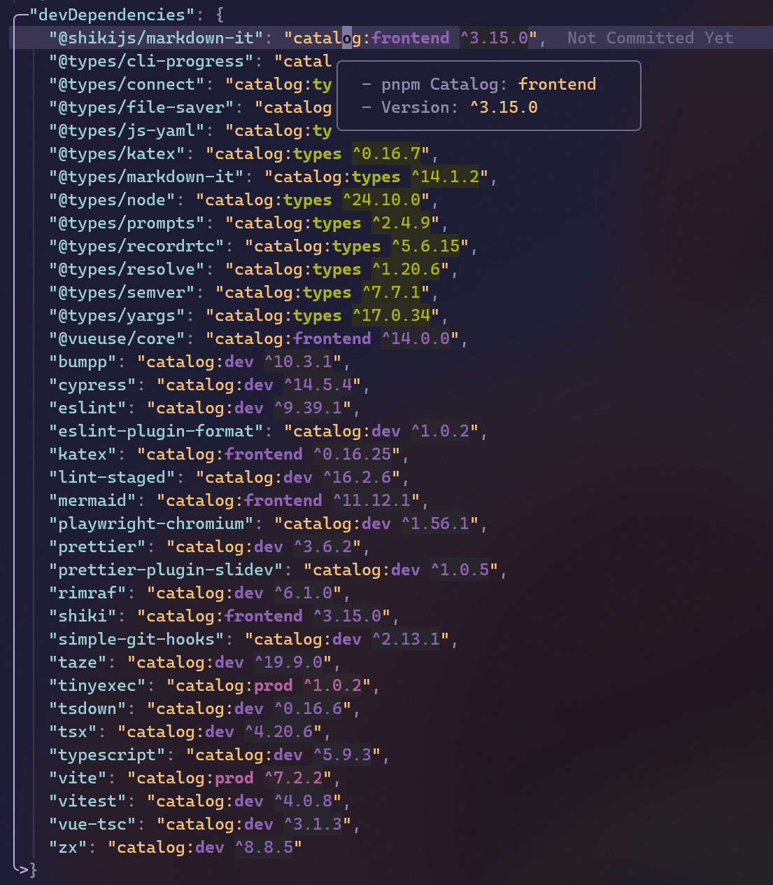

# catalog-lens.nvim

Show inlay version and go-to-definition for PNPM/Yarn/Bun catalogs.



## ✨ Features

- Show inline version information for package catalogs
- Go-to-definition support for catalog entries
- Works with PNPM, Yarn, and Bun catalogs

## ⚡️ Requirements

- Neovim >= 0.10.0

## 📦 Installation

Using [lazy.nvim](https://github.com/folke/lazy.nvim):

```lua
{
  "Daydreamer-riri/catalog-lens.nvim",
  opts = {},
}
```

## ⚙️ Configuration

**catalog-lens.nvim** comes with the following defaults:

```lua
{
  -- Enable the plugin
  enabled = true,
  -- Control whether to use color in nvim_buf_set_extmark
  namedCatalogsColors = true,
  -- Control whether to use custom rendering for hint
  useOriginalInlayHint = false,
}
```

## 🚀 Usage

The plugin will automatically detect package catalogs and show inline version information.

### Commands

You can use the following Lua functions to control the plugin:

- `require("catalog-lens").enable()`: Enable the plugin and LSP.
- `require("catalog-lens").disable()`: Disable the plugin and LSP.
- `require("catalog-lens").toggle()`: Toggle the plugin state.

## Credits

Inspired by [vscode-pnpm-catalog-lens](https://github.com/antfu/vscode-pnpm-catalog-lens) by [Anthony Fu](https://github.com/antfu)

## 📝 License

[MIT](./LICENSE)
